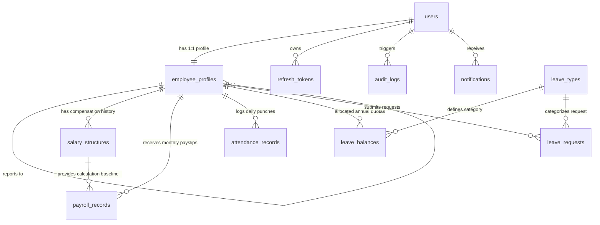

# Dayflow HRMS — Modern Enterprise Workforce Operating System

Dayflow is a self-hosted Human Resource Management System (HRMS) engineered for high reliability, database normalization, auditable financial records, and defense-in-depth security.

---

## 🌟 Executive Summary & Key Highlights

- **Self-Hosted Relational Database (No BaaS)**: Powered by PostgreSQL / SQLite with 3NF normalized schema design and Prisma ORM migrations.
- **Custom RESTful API Architecture**: Strict layered architecture (`routes` $\rightarrow$ `middlewares` $\rightarrow$ `controllers` $\rightarrow$ `services` $\rightarrow$ `repositories`).
- **Auditable Versioned Payroll**: Salary revisions are immutable historical structures (`salary_structures`) guaranteeing reproducible historical payslips and audit trails.
- **Role-Based Access Control (RBAC)**: Route-level server-side permission enforcement (`ADMIN`, `HR_MANAGER`, `EMPLOYEE`) preventing BOLA / IDOR vulnerabilities.
- **Punch Clock & Muster Roll**: Live attendance tracker with elapsed work timers, work mode classification (Office/Remote/Hybrid), duplicate prevention, and managerial adjustment overrides.
- **Automated Leave Workflows**: Annual quota tracking, date overlap validation, pending balance reservation, and automatic muster roll synchronization upon approval.
- **Security Hardened**: Bcrypt (cost 12), short-lived JWTs (15 min) with single-use rotating refresh tokens, token reuse detection, Zod schema validation, Helmet headers, IP rate limiting, and tamper-evident audit logging with before/after JSON diffs.
- **1-Click Hackathon Persona Switcher**: Instant switching between Admin, HR Manager, Staff Software Architect, and Principal Designer in the UI.

---

## 🏗️ Relational Data Model (Normalized 3NF)



For full database architectural rationale, compound constraint analysis, and entity details, see [docs/ER_DIAGRAM.md](docs/ER_DIAGRAM.md).

---

## 👥 Hackathon Demo Credentials

All seeded demo accounts use the standard password: `Password@123`

| Persona / Name | Email | Badge ID | Role | Focus / Capabilities |
| :--- | :--- | :--- | :--- | :--- |
| **Sarah Connor** | `admin@dayflow.internal` | `EMP-0001` | `ADMIN` | VP Operations — Full access, Audit Logs, Batch Payroll |
| **Marcus Vance** | `hr@dayflow.internal` | `EMP-0002` | `HR_MANAGER` | Lead People Ops — Leave approvals, Muster roll, Onboarding |
| **Alex Chen** | `alex.chen@dayflow.internal` | `EMP-1001` | `EMPLOYEE` | Staff Architect — Self-service attendance, PTO, Payslips |
| **Elena Rodriguez**| `elena.rodriguez@dayflow.internal`| `EMP-1002` | `EMPLOYEE` | Principal Designer — Personal quotas & profile management |

> **Pro Tip**: Use the **"Switch Role (Demo)"** button in the top navbar to switch between personas instantly during live hackathon judging.

---

## 🚀 Quickstart & Local Setup

### Option 1: Standard Local Development (Zero-Config)

#### 1. Backend Setup
```bash
cd backend
npm install
npx prisma generate
npx prisma db push
npm run prisma:seed
npm run dev
# Backend starts on http://localhost:5000
```

#### 2. Frontend Setup
```bash
cd ../frontend
npm install
npm run dev
# Frontend starts on http://localhost:5173
```

---

### Option 2: Full Docker Compose Deployment (PostgreSQL + Backend + Frontend)
```bash
docker-compose up --build
```
- Frontend: `http://localhost:5173`
- Backend API: `http://localhost:5000`
- PostgreSQL: `localhost:5432`

---

## 🧪 Running Automated Backend Tests

Dayflow includes an integration test suite built on Vitest & Supertest verifying:
- Authentication credentials and JWT token rotation
- Route-level RBAC (Employees blocked from `/audit-logs` and elevated endpoints with 403)
- Attendance duplicate prevention and working hour calculations
- Leave quota reservation and overlap conflict rejection (409)
- Versioned salary structure creation and archiving

```bash
cd backend
npm test
```

Test Results Summary:
```text
 ✓ tests/business-logic.test.ts (9 tests)
 ✓ tests/auth.test.ts (6 tests)

 Test Files  2 passed (2)
      Tests  15 passed (15)
```

---

## 📑 API Surface & Documentation

| Endpoint Group | Description | Auth & Permissions |
| :--- | :--- | :--- |
| `/api/v1/auth` | Login, Register, Refresh Token Rotation, Logout, Me, Password Change | Public & Authenticated |
| `/api/v1/employees` | Search, List, 360 Profile, Onboarding, Status updates | RBAC (`ADMIN`, `HR_MANAGER`, Self) |
| `/api/v1/attendance` | Check-in, Check-out, Today status, Team muster roll, Manual override | RBAC (`ADMIN`, `HR_MANAGER`, Self) |
| `/api/v1/leave` | Quotas, Apply leave, Cancel request, Approval queue | RBAC (`ADMIN`, `HR_MANAGER`, Self) |
| `/api/v1/payroll` | Versioned salary structures, Batch payroll run, Payslips, PDF receipts | RBAC (`ADMIN`, `HR_MANAGER`, Self) |
| `/api/v1/audit-logs` | Immutable audit ledger with JSON diff snapshots | Strict `ADMIN` only |
| `/api/v1/notifications` | In-app notification center & status alerts | Any Authenticated |
| `/api/v1/dashboard` | Executive KPI aggregates & Employee self-service metrics | Context-aware |

For complete request/response schemas and HTTP error codes, see [docs/API_DOCUMENTATION.md](docs/API_DOCUMENTATION.md).

---

## 🔒 Security Architecture Summary

For the full security audit and dependency scan report, see [docs/SECURITY_ANALYSIS.md](docs/SECURITY_ANALYSIS.md).

1. **Bcrypt Password Hashing**: Cost factor 12.
2. **Short-Lived JWT + Single-Use Rotating Refresh Tokens**: 15 min access expiry + automated token reuse breach detection.
3. **Zod Edge Validation**: Strict schema enforcement rejecting unknown parameters.
4. **Prisma Parameterized Queries**: Eliminates SQL injection vectors.
5. **Helmet & Rate Limiting**: Security headers + IP brute-force protection on auth routes.
6. **Tamper-Evident Audit Ledger**: JSON before/after state differentials recorded for all administrative mutations.
