# Dayflow HRMS — Data Model & Relational Schema

## Entity-Relationship Diagram

```mermaid
erDiagram
    users ||--|| employee_profiles : "has 1:1 profile"
    users ||--o{ refresh_tokens : "owns"
    users ||--o{ audit_logs : "triggers"
    users ||--o{ notifications : "receives"

    employee_profiles ||--o{ employee_profiles : "reports to manager"
    employee_profiles ||--o{ salary_structures : "has compensation history"
    employee_profiles ||--o{ payroll_records : "receives monthly payslips"
    employee_profiles ||--o{ attendance_records : "logs daily punches"
    employee_profiles ||--o{ leave_balances : "allocated annual quotas"
    employee_profiles ||--o{ leave_requests : "submits requests"

    leave_types ||--o{ leave_balances : "defines category"
    leave_types ||--o{ leave_requests : "categorizes request"

    salary_structures ||--o{ payroll_records : "provides calculation baseline"

    users {
        string id PK "UUID"
        string email UK "Unique corporate email"
        string employeeId UK "Unique staff badge identifier (e.g. EMP-1001)"
        string passwordHash "Bcrypt hash (cost 12)"
        enum role "ADMIN | HR_MANAGER | EMPLOYEE"
        enum status "ACTIVE | INACTIVE | SUSPENDED"
        boolean isEmailVerified "Verification state"
        datetime createdAt "Timestamp"
        datetime updatedAt "Timestamp"
    }

    employee_profiles {
        string id PK "UUID"
        string userId FK,UK "1:1 reference to users.id"
        string firstName "First Name"
        string lastName "Last Name"
        string phone "Phone number"
        datetime dateOfBirth "DOB"
        string gender "Gender"
        string address "Residential address"
        enum department "ENGINEERING | PRODUCT | DESIGN | HUMAN_RESOURCES | MARKETING | SALES | FINANCE | OPERATIONS"
        string designation "Job title"
        datetime dateOfJoining "Date of joining"
        enum employmentType "FULL_TIME | PART_TIME | CONTRACT | INTERN"
        string reportingManagerId FK "Self-referencing manager profile ID"
        string emergencyContact "Emergency contact details"
        string avatarUrl "Profile image URL"
        string documents "JSON metadata of uploaded documents"
        datetime createdAt "Timestamp"
        datetime updatedAt "Timestamp"
    }

    salary_structures {
        string id PK "UUID"
        string employeeId FK "Profile reference"
        datetime effectiveDate "Effective commencement date"
        float baseSalary "Base compensation"
        float hra "House Rent Allowance"
        float allowances "Special/transport allowances"
        float deductions "Standard tax/PF deductions"
        float grossSalary "Base + HRA + Allowances"
        float netSalary "Gross - Deductions"
        boolean isCurrent "Active structure flag"
        string currency "USD / INR / EUR"
        string remarks "Revision reason / hike note"
        string createdById "Admin/HR user who created record"
        datetime createdAt "Timestamp"
        datetime updatedAt "Timestamp"
    }

    payroll_records {
        string id PK "UUID"
        string employeeId FK "Profile reference"
        string salaryStructureId FK "Salary structure baseline reference"
        int month "Payroll cycle month (1-12)"
        int year "Payroll cycle year"
        datetime paymentDate "Disbursement timestamp"
        float baseAmount "Base amount paid"
        float hraAmount "HRA paid"
        string allowancesBreakdown "JSON breakdown of bonuses/allowances"
        string deductionsBreakdown "JSON breakdown of tax/deductions/unpaid leave"
        float grossAmount "Total Gross"
        float netAmount "Total Net Payable"
        enum status "DRAFT | PROCESSED | PAID"
        string transactionReference "Banking/payroll transfer reference"
        string notes "Payroll notes"
        datetime createdAt "Timestamp"
        datetime updatedAt "Timestamp"
    }

    attendance_records {
        string id PK "UUID"
        string employeeId FK "Profile reference"
        datetime date "Date at 00:00:00 UTC (Compound UK with employeeId)"
        datetime checkInTime "Clock in timestamp"
        datetime checkOutTime "Clock out timestamp"
        enum status "PRESENT | ABSENT | HALF_DAY | ON_LEAVE | HOLIDAY | WEEKEND"
        float totalHours "Calculated working duration in hours"
        enum workMode "OFFICE | REMOTE | HYBRID"
        string notes "Check-in comments"
        string ipAddress "Client IP address for audit"
        datetime createdAt "Timestamp"
        datetime updatedAt "Timestamp"
    }

    leave_types {
        string id PK "UUID"
        string name UK "Paid Time Off / Sick Leave / Casual Leave / Maternity"
        string code UK "PTO / SL / CL / ML"
        float maxDaysPerYear "Annual entitlement"
        boolean isPaid "Paid vs Unpaid leave"
        string description "Policy description"
        datetime createdAt "Timestamp"
        datetime updatedAt "Timestamp"
    }

    leave_balances {
        string id PK "UUID"
        string employeeId FK "Profile reference"
        string leaveTypeId FK "Leave type reference"
        int year "Calendar cycle year"
        float totalAllocated "Allotted quota"
        float usedDays "Approved taken days"
        float pendingDays "Pending request days"
        float remainingDays "totalAllocated - usedDays - pendingDays"
        datetime createdAt "Timestamp"
        datetime updatedAt "Timestamp"
    }

    leave_requests {
        string id PK "UUID"
        string employeeId FK "Profile reference"
        string leaveTypeId FK "Leave type reference"
        datetime startDate "Commencement date"
        datetime endDate "Conclusion date"
        float totalDays "Requested working days duration"
        string reason "Employee justification"
        enum status "PENDING | APPROVED | REJECTED | CANCELLED"
        datetime appliedAt "Application timestamp"
        string approvedById "Reviewer user ID"
        string adminRemarks "Decision commentary"
        datetime reviewedAt "Decision timestamp"
        datetime createdAt "Timestamp"
        datetime updatedAt "Timestamp"
    }

    audit_logs {
        string id PK "UUID"
        string userId FK "User actor ID"
        string userEmail "Actor email snapshot"
        string action "Event: AUTH_LOGIN, SALARY_UPDATE, LEAVE_APPROVE, etc."
        string resourceType "Target entity: EMPLOYEE, PAYROLL, LEAVE, etc."
        string resourceId "Target entity ID"
        string changesDiff "JSON serialized before/after payload"
        string ipAddress "Actor IP"
        string userAgent "Actor client User-Agent"
        datetime createdAt "Timestamp"
    }

    notifications {
        string id PK "UUID"
        string userId FK "Recipient user ID"
        string title "Notification header"
        string message "Notification body text"
        enum type "INFO | SUCCESS | WARNING | ACTION_REQUIRED"
        boolean isRead "Read status"
        string linkUrl "Deep link destination"
        datetime createdAt "Timestamp"
    }

    refresh_tokens {
        string id PK "UUID"
        string userId FK "User reference"
        string tokenHash UK "Cryptographic SHA256 token digest"
        datetime expiresAt "Expiration timestamp"
        boolean revoked "Revocation flag"
        string replacedByToken "Successor token digest in rotation"
        datetime createdAt "Timestamp"
    }
```

---

## Architectural & Schema Design Rationale

### 1. Immutable & Versioned Salary Structures
In enterprise HR and accounting compliance, an employee's salary is **never** a single mutable column on the profile table. Modifying salary directly in place destroys the historical financial record required for tax recalculations, retrospective payslip generation, and audits.
- **Design Choice**: `salary_structures` stores dated revisions. Only one revision is marked `isCurrent = true` per employee. When a raise or compensation change occurs, the existing record is closed out and a new version is inserted.
- **Benefit**: `payroll_records` point directly to the exact `salary_structure_id` active during that billing period, ensuring 100% reproducible historical payslips.

### 2. Separation of Attendance and Leave Records
While both track employee presence, they represent fundamentally different business concepts:
- **`attendance_records`** track empirical physical or remote presence (clock-in, clock-out, calculated hours, IP telemetry, device mode). It enforces a strict compound unique constraint `(employee_id, date)` to eliminate race conditions and double-punch anomalies.
- **`leave_requests`** track multi-day workflow intents (planning, policy validation, supervisor approvals, balance deductions).
- **Synergy**: When a leave request transitions to `APPROVED`, the business logic automatically fills or flags corresponding dates in `attendance_records` as `status: ON_LEAVE`, guaranteeing consistent reporting without table bloat.

### 3. Dedicated `leave_balances` with Annual Versioning
Quota rules reset annually and require real-time validation upon application:
- Tracking `totalAllocated`, `usedDays`, `pendingDays`, and `remainingDays` per `(employee_id, leave_type_id, year)` prevents race conditions where an employee submits multiple simultaneous overlapping requests that exceed their quota.

### 4. Forensic Audit Trail with JSON Differential Snapshots
Human Resource systems store protected PII, compensation data, and managerial decisions subject to regulatory scrutiny.
- **Design Choice**: The `audit_logs` table records actor identity, action type, resource reference, and structured JSON diffs (`{ "before": {...}, "after": {...} }`).
- **Security Benefit**: Provides tamper-evident logs for administrative accountability, dispute resolution, and security breach investigation.

### 5. Refresh Token Rotation & Server-Side Invalidation
- Refresh tokens are hashed via SHA-256 before storage in `refresh_tokens`.
- Every refresh token exchange automatically invalidates the used token and issues a new pair (**Token Rotation**).
- If a revoked token is presented, the system detects a token reuse attempt and can invalidate all active sessions for that user.
